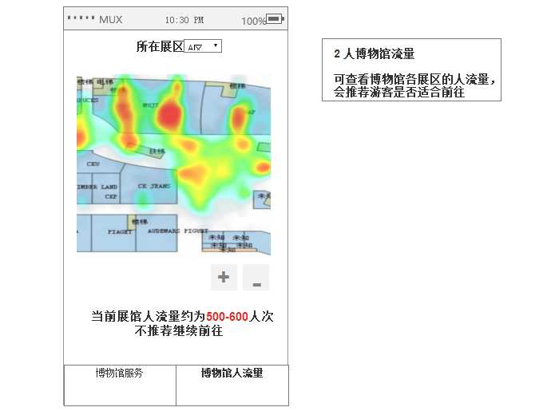
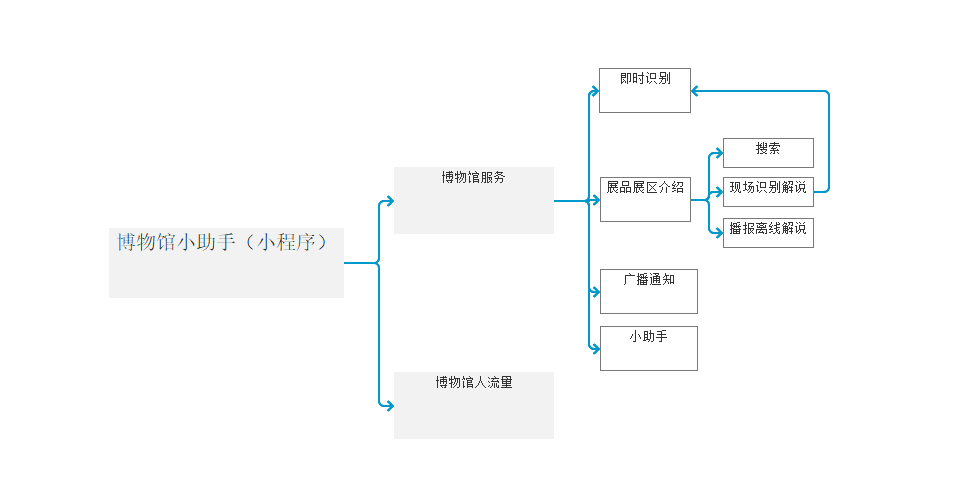

# 动静皆宜博物馆

## 市场
目前市面上针对特殊群体的动静皆宜博物馆的应用较少，使用范围不广泛。

##  产品定位
本产品旨在为多动症者和身障者提供更方便游览参观博物馆，提高游客参与感的应用

## 目标用户
- 博物馆解说人员

当接待的游客中有身障者，可以提供此应用。当服务游客过多的情况下，可把展品的解说词录入，方便游客使用。

- 身障者

对身体不便的身障者：使用人流量统计，可以避免游客过多造成的意外和更好的游览博物馆。
对听力身障者：可以在博物馆解说员解说的时候使用语音识别的功能，看转化后的文字即可了解展品信息。

- 多动症者

多动症者可能会经常不合群，对很多展品都感兴趣，可使用博物馆解说人员提前录好的语音对展品进行了解。

## PRD1：价值宣言
本产品旨在通过应用百度api的语音识别、语音合成和人流量统计api来更好的为多动症者和身障者提供参观和游览博物馆的服务和体验，体现人文关怀。

## PRD2:核心价值（最小完成项）
- 语音识别：

将音频录为应用程序，可以向用户显示或作为命令输入操作的文本，通过此API可以博物馆解说人员可以将展品的介绍词录入，将其转化成文字，提供给有听力障碍的人。也可以在博物馆解说人员不足的情况下，为游客提供离线文字解说服务。

- 语音合成：

当身障者不方便浏览展品的说明时，此功能可以解决身障者的疑惑，解决了解说员人数不够的问题。

- 人流量统计：

为身体不便的残障人士和其他游客提供展馆的人流量情况，避免人流过多拥挤产生的意外，和产生不好的游玩体验。

## PRD3:用户痛点
用户|用户痛点 | 所需api
---|---|---
多动症者 | 多动症者可能会经常脱群，对很多展品都感兴趣，但不能及时知道展品信息。 | 语音合成
身障者（身体障碍） | 在游览博物馆时，不方便参观和观看展品信息，博物馆游玩体验弱；不方便在人流量过多的地方，以免造成伤害。 | 语音识别、人流量统计
身障者（聋哑人士） | 无法听到现场解说和博物馆的紧急广播 | 语音识别
博物馆解说员 | 游客过多，不能一一向游客解说 | 语音合成
普通游客 | 博物馆游客过多，造成阻塞，不知道从何看起。 | 人流量统计api

## PRD4：人工智能概率性

语音识别：解说员的普通话不标准，识别出的文字信息不准确。

语音合成：文字信息中有多音字，合成的语音可能有误差。

## PRD5：需求列表
需求 | 重要程度 | 解决
---|---|---
博物馆解说员数量不足 | 重要 | 语音合成
身障者和多动症者能更好的游览博物馆和获取信息。 | 非常重要 | 语音识别、语音合成
其他游客在博物馆的游览过程中能得到更好的沉浸感 | 重要 | 人浏览统计api

## 产品原型 

## 信息设计

- 即时识别（语音识别）

- 展区展品介绍（语音识别、语音合成）

- 广播通知（语音合成）

- 博物馆人流量（人流量统计）

## 产品架构

## 产品流程图

## 产品原型链接
- [产品原型链接](http://nfunm089.gitee.io/museum/)

- [产品原型源文件](博物馆api.rp)

## api使用水平
- 语音合成

 语音合成输入
 
 
 
  语音合成输出
 
 
 
 输入：文字 → 输出：音频
 
 - 人流量统计

 
 
 输入：图片 → 输出：数字
 
 - 语音识别
 输入：音频 → 输出：文字
 
 ## api文档
 - [语音合成api使用文档](code/语音合成api文档.ipynb)
 - [人流量统计api使用](code/人流量统计api调用.ipynb)
